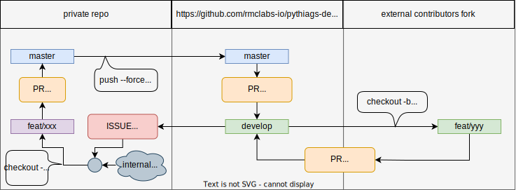

# Contributing

Because the code is meant to be run using NVIDIA hardware, the continuous integration
(used for formatting, linting, and testing) runs on our own self hosted devices (both
Jetson and GPU)). Our main repo is private then for security reasons, and we sync
both internal and external contributions in the following manner:

We find this cumbersome but at the moment it's the safest bet we've got. If you can
think of better alternatives, please get in touch!

## External contributors (witha access to pythiags-dev)

1. fork pythiags-dev
2. clone the fork
3. Pull Request from new branch into **develop**.
4. [Optional, recommended]: use provided devcontainer.
5. [Optional, recommended]: run `pre-commit install` to validate commits.
6. add tests, docs, code, scripts, etc
7. [Optional] check code manually, with `./scripts/format`, `./scripts/lint`,
  `./scripts/docs`, `./scripts/test`, etc.
8. Commit using
  [Conventional commits](https://www.conventionalcommits.org/en/v1.0.0/#summary).
9. push, wait for ci and/or maintainers feedback
10. repeat 6-8 until success!
11. Your contribution should appear in upcoming release

## Internal contributors (with access to private repo)

1. fork private repo
2. clone
3. Pull Request from new branch into **master**
4. [Optional, recommended]: use provided devcontainer.
5. [Optional, recommended]: run `pre-commit install` to validate commits.
6. add tests, docs, code, scripts, etc
7. [Optional] check code manually, with `./scripts/format`, `./scripts/lint`,
  `./scripts/docs`, `./scripts/test`, etc.
8. Commit using
  [Conventional commits](https://www.conventionalcommits.org/en/v1.0.0/#summary).
9. push, wait for ci and/or maintainers feedback
10. repeat 6-8 until success!
